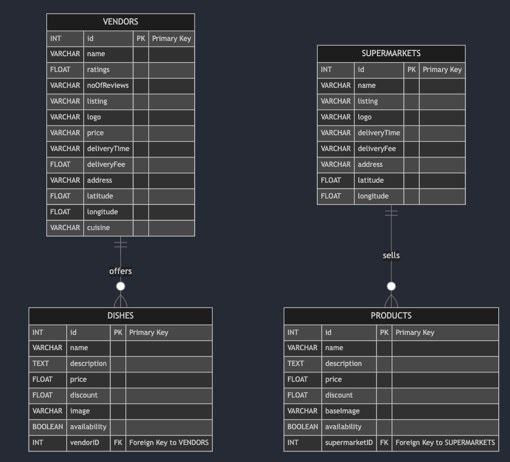

# pandaclose - foodpanda Hackathon (Backend)

## Overview
pandaclose is a sustainability-driven feature for a food delivery app that helps reduce food waste. Vendors can list closing deals on dishes nearing expiration, while consumers can explore these deals via a list view or map view. The backend powers the mySQL database hosted on Docker.

<p align="center">
  
</p>

This repository contains the backend implementation built using Golang, MySQ, and containerized with Docker Compose and Colima.

* [Frontend Repository](https://github.com/averygan/bon-appetea-frontend) (React, Tailwind CSS)
* [Backend Repository](https://github.com/averygan/bon-appetea-backend) (Golang, MySQL, Docker Compose, Colima)

## Table of Contents
1. [Installation and Setup](#installation--setup)
2. [Performing Database Queries](#performing-database-queries)
3. [Database Schema](#database-schema)

## Installation & Setup
Follow these steps to run the backend server and database locally:


### Install the following on your machine
- Go (`brew install go`)
- Docker & Docker Compose (`brew install docker docker-compose`)
- Colima (`brew install colima`)

### Hosting the database
1. Start colima
    ```bash
    colima start
    ```

2. Navigate to the `/backend/goapp` directory
    ```bash
    cd backend/goapp
    go mod tidy
    ```
3. Navigate to the `/backend` directory
    ```bash
    cd backend
    docker-compose up --build -d
    ```
4. Test the server health with
    ```bash
    curl http://localhost:8080/ping
    ```

## Performing Database Queries
There are 5 endpoint routes on backend service running on port 8080, accessible via frontend service running on port 5173:

Each query should be prefixed with `curl http://localhost:8080`, following by the following suffix commands:
- `/ping` (GET): server health-check
- `/vendors` (GET): fetch vendors
- `/dishes` (GET): fetch dishes
- `/vendors/{id}` (GET): fetch vendors by id
- `/dishes/vendors/{id}` (GET): fetch dishes by vendor id

Supermarkets and products are currently unused attributes that could be included in future builds.

## Database Schema
The MySQL database schema supports vendors, dishes, supermarkets, and products, capturing relationships between food vendors, listed dishes, and supermarkets offering rescue products.

<p align="center">
  
</p>

For detailed changes or future edits, refer to the [Mermaid.js source file](./assets/readme/schema.mmd).